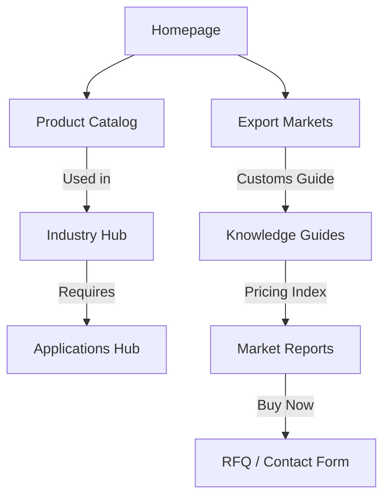

# AGROX CONTENT ENGINE: Architecture & Future Scaling

This document defines the content architecture, folder structures, URL directory schemes, and cross-linking strategies for the AGROX agricultural export platform. It acts as a guide for expanding the site to support thousands of pages while maintaining visual coherence and SEO authority.

---

## 1. Directory & URL Architecture
To support future scaling, all content is segregated into logical folder hubs. This structure separates core marketing from dynamic product databases.

| Content Hub | Folder Path | URL Structure | Description |
|---|---|---|---|
| **Products** | `/products/` | `/products/{product-slug}-exporter-from-india.php` | Specific crop detail pages (e.g. `cumin-seeds-exporter-from-india.php`). |
| **Countries** | `/countries/` | `/countries/{country-slug}-import-guidelines.php` | Import compliance and customs parameters for target markets (e.g. `uae-import-guidelines.php`). |
| **Industries** | `/industries/` | `/industries/{industry-slug}.php` | B2B sector pages (e.g. `food-manufacturing.php`, `pharma.php`). |
| **Applications** | `/applications/` | `/applications/{use-case-slug}.php` | Grade formulations and custom specifications (e.g. `spice-blending.php`). |
| **Knowledge** | `/knowledge/` | `/knowledge/buyer-guide-{product-slug}.php` | General guides and shipping advisories (e.g. `buyer-guide-cardamom.php`). |
| **Market Reports** | `/market-reports/` | `/market-reports/{month-year}-crop-index.php` | Harvest pricing indices and route advisories. |

---

## 2. Dynamic Cross-Linking Web
To ensure PageRank flow and user retention, pages must establish automated internal references. The cross-linking matrix defines these rules:



### 2.A Cross-Link Requirements
1.  **Product to Industry:** Every product detail page must link to at least 2 relevant industries (e.g. Cumin seeds page must link to `/industries/food-manufacturing.php` and `/industries/spice-blenders.php`).
2.  **Country to Product:** Country guides must reference their main import products (e.g. UAE profile must link directly to `/products/basmati-rice-1121-exporter-from-india.php` and `/products/cardamom-powder-exporter-from-india.php`).
3.  **Market Report to RFQ:** Every market pricing report must contain a high-contrast B2B quotation form passing the current crop name dynamically as a parameter (e.g. `/contact-us.php?type=quote&product={crop-name}`).

---

## 3. Future Scaling Blueprint
When scaling the catalog to support hundreds of items:

### 3.A Database-Driven Templates
*   **Static to Dynamic:** As page count exceeds 150, replace flat `.php` file structures with a relational database (e.g., MySQL) and a template controller (`product-detail.php?slug=cumin`).
*   **Routing Control:** Use `.htaccess` rewrite rules to hide parameters and maintain flat, descriptive URLs:
    ```apache
    RewriteRule ^products/([a-zA-Z0-9-]+)-exporter-from-india$ product-detail.php?slug=$1 [L,QSA]
    ```

### 3.B Resource Optimization
*   **Asset Self-Hosting:** Self-host all core display media. Use optimized AVIF/WebP formats with explicit width/height parameters.
*   **Grayscale Logo Slider Caching:** Ensure the partners/certification marquee pulls SVG logos from a local folder to avoid external network requests.
